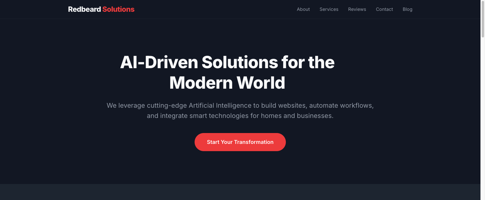
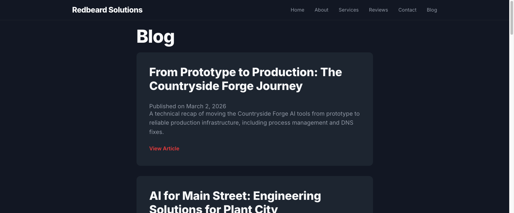
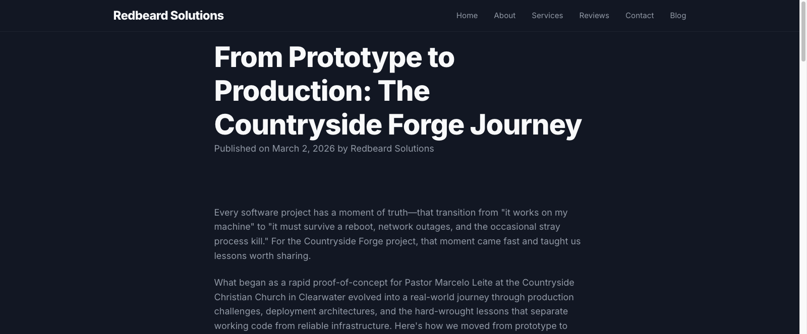

# Redbeard Solutions Website

**Live Site:** [redbeardtampa.com](https://redbeardtampa.com)

**Repository:** [github.com/itspaulknoll/redbeard-solutions](https://github.com/itspaulknoll/redbeard-solutions)

---

## Overview

Redbeard Solutions is a veteran-owned technology firm bridging the gap between physical hardware and digital intelligence. From AI-assisted development to luxury smart home integration, we deliver future-proof results.

This website was entirely designed, coded, and deployed using AI-assisted development - a demonstration of our commitment to cutting-edge technology integration.

---

## Screenshots

### Home Page

*AI-Driven Solutions for the Modern World homepage*

### Blog Section

*Blog archive showcasing all technical articles with navigation*

### Blog Post View

*Blog entry with full content, navigation, and AI workflow documentation*

---

## Tech Stack

### Core Technologies
- **HTML5** - Semantic markup and accessible structure
- **CSS3** - Modern CSS with custom properties, Flexbox, Grid
- **JavaScript** - Vanilla JS for interactive elements

### Deployment & Infrastructure
- **GitHub Pages** - Automatic deployment from main branch
- **Custom Domain** - redbeardtampa.com via CNAME

---

## AI Development Workflow

This project demonstrates a **100% AI-assisted development** approach to web development.

### Tools & Platforms Used

#### Claude / OpenClaw AI Assistant
- **Primary Development Tool:** All code, content, and deployment orchestrated via AI agent
- **Communication:** Telegram integration for seamless prompting
- **Multi-Modal Capabilities:** Browser automation, file operations, code generation

#### Workflow Components

1. **Code Generation**
   - Natural language prompting → executable code
   - Pattern following across codebase
   - Idempotent, reversible operations

2. **Prompting Strategies**
   ```
   • Iterative refinement - Start broad, narrow down
   • Pattern reference - "Match [existing_file] style"
   • Constraint expression - "Never use X", "Always Y"
   • Context preservation - Reference memory files for consistency
   ```

3. **Browser Automation**
   - Automated git commits and pushes
   - Automated social posting (X.com) for blog announcements
   - Testing via browser snapshots

4. **Content Workflow**
   ```
   Draft → Edit → Review → Commit → Deploy → Announce
     ↑                                  ↑
     └──── All via AI Prompt ─────┘
   ```

---

## Project Structure

```
redbeard_website/
├── README.md                    # This file
├── index.html                   # Main landing page
├── blog.html                    # Blog archive/index
├── blog-post-1.html ...         # Individual blog entries
├── style.css                    # Main stylesheet
├── script.js                    # Client-side interactivity
├── logo.png                     # Site branding
├── DEPLOYMENT.md                # Deployment configuration
└── demos/                       # Project demonstrations
    ├── next-gen-catalyst/       # Forge dashboard demo
    └── next-gen-impact/         # Impact calculator
```

---

## Content Workflow

### Publishing a Blog Post

1. **Create entry:** `redbeard_website/blog-post-N.html` (copy previous format)
2. **Update navigation:** Link from previous post, add to blog.html index
3. **Commit:** Git add → commit → push
4. **Deploy:** Automatic via GitHub Pages
5. **Announce:** Browser automation posts to X.com automatically

Full workflow documented in: `memory/2026-03-02-blog-x-pipeline.md`

---

## Development Standards

This project follows Redbeard Solutions' core principles:

1. **Idempotent Operations** - Safe to run multiple times
2. **Testable & Reversible** - Can undo any change
3. **Pattern Consistency** - New code matches existing patterns
4. **Documentation** - Workflows captured inmemory/
5. **Autonomous Execution** - AI can operate without supervision

---

## License & Credits

**Built by:** Redbeard Solutions | AI-Driven Technology Integration

**Method:** 100% AI-assisted development (Claude/OpenClaw)

**License:** ISC / MIT

**Questions?** Contact via Telegram or submit to repository issues.

---

*Last Updated: 2026-03-03*
*Built with Claude/OpenClaw AI assistance*
